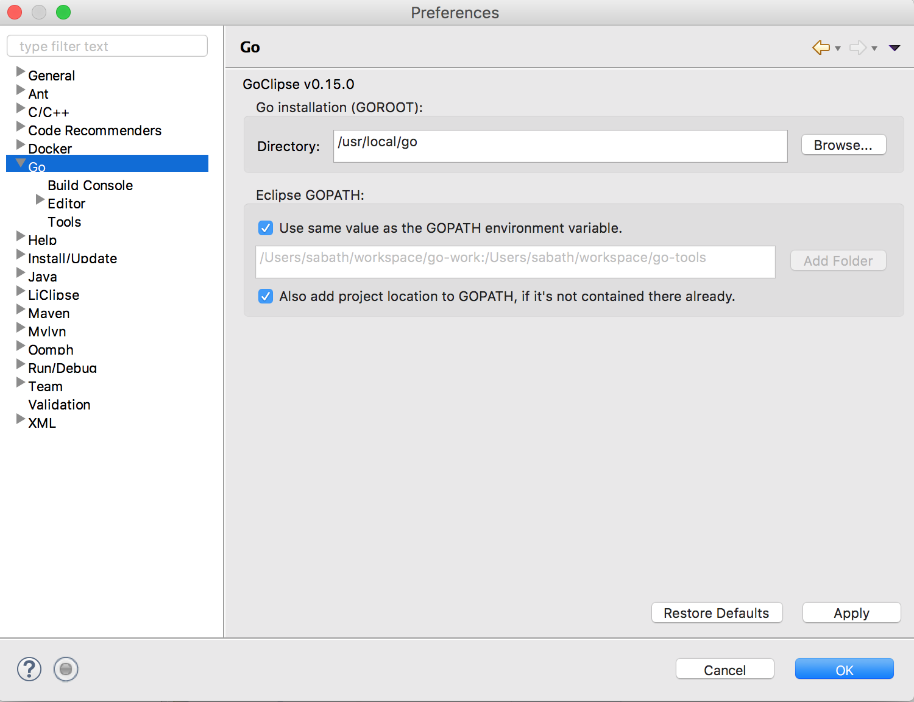
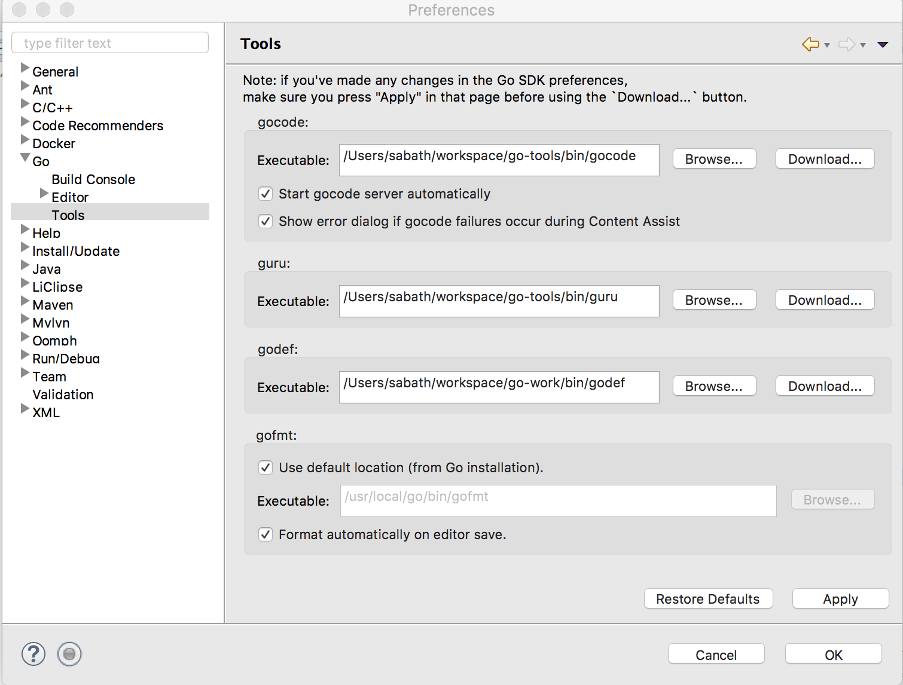

## Setting up development environment using Eclipse
### Install Eclipse
Install Eclipse and GoClipse plugin according to this [document](https://github.com/GoClipse/goclipse/blob/latest/documentation/Installation.md#installation). Here is the [User Guide](https://github.com/GoClipse/goclipse/blob/latest/documentation/UserGuide.md) for it.

### Install Go
Install Go on your workstation. [Installs](https://golang.org/dl/)

Create `go-tools` directory:

```bash
mkdir -p ~/workspace/go-tools
export GOPATH=~/workspace/go-tools
export GOROOT=/usr/local/go
```

Install `gocode` and `oracle` to `go-tools` and `godep`:

```bash
go get -u github.com/nsf/gocode
go get golang.org/x/tools/cmd/oracle
go get github.com/tools/godep
```

To support TOML format configuration, install the TOML parser

```bash
go get -u github.com/BurntSushi/toml
go get -u github.com/spf13/viper
```

### Setup env. variables
in ~/.bash_profile add:

```bash
export GOPATH=~/workspace/go-work:~/workspace/go-tools
```

### Clone the Go Project from your fork to fr8r workspace:

```bash
cd ~/workspace/fr8r
git clone https://github.com/<github_username>/fr8r-proxy.git
```


### Start Eclipse
Find and open eclipse from command line using above ENV. Workspace should be outside of GOPATH:

```bash
cd ~/eclipse/java-latest-released/Eclipse.app/Contents/MacOS
./eclipse --clean
```
Here is the script I am using to start Eclipse:

cat Eclipse_Fr8r.command

```bash
export GOPATH=~/workspace/go-work:~/workspace/go-tools
cd ~/eclipse/java-latest-released/Eclipse.app/Contents/MacOS
./eclipse --clean
```


Select your workspace:

```bash
~/workspace/fr8r
```
### Eclipse configuration
Open Preferences, GO:


Preferences, GO, Tools:


New Go Project (fr8r-proxy)

```bash
name: --> fr8r-proxy
location: --> ~/workspace/fr8r/fr8r-proxy
```
It should popup a message that directory already exists, wizard will detect
an existing project. Finish and let switching to Go Perspective


It should compile. Make sure you have `~/workspace/fr8r/fr8r-proxy/bin` directory
